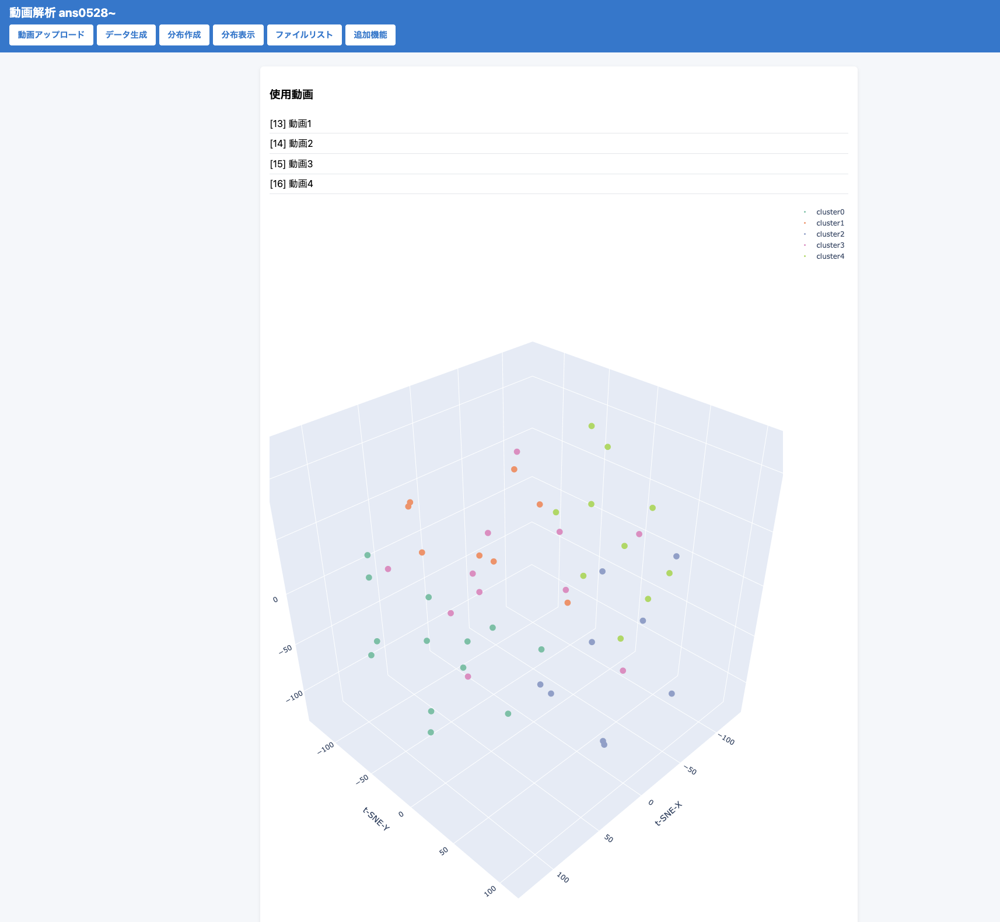

# 🏃‍♀️ IPRO – no06 Video-Analytics Demo

A lightweight **Django 5** demo for pose-based video analytics.

1. **Upload videos**
2. **Extract pose-based RGB features** (4 keypoints × RGB = 12-D)
3. **Cluster them** with TSNE (3-D) + K-Means (5 clusters)
4. **Visualize** everything in an interactive 3-D scatter plot



---

## ✨ Key Features

| UI Button | What It Does |
|-----------|--------------|
| **Upload** | Save an MP4 to `media/videos/` (*no page reload* – AJAX) |
| **Generate** | YOLOv8-Pose (shoulders + hips) → 1 fps → 12-D RGB vectors |
| **Cluster** | t-SNE (3-D) + K-Means (5 clusters) → DB update |
| **Show** | Plotly 3-D scatter, hover names, **thumbnail preview on point-click** |
| **Play ▶** | 1-sec slideshow of YOLO-keypoint frames (modal) |
| **Files** | In-browser file browser for quick source inspection |
| **Extras** | Switch to *red-header* screen – contains **One-Click** (Generate→Cluster→Show in one go) |

Responsive UI (Flexbox + Plotly) – works down to ~ 380 px width.

---

## 🤖 Tech Stack
| Layer      | Choice                                    | Note              |
|------------|-------------------------------------------|-------------------|
| **Pose**   | ultralytics **YOLOv8-Pose**               | `yolov8n-pose.pt` |
| **ML / Vis** | *scikit-learn* (t-SNE, K-Means) + **Plotly** |                   |
| **Backend** | **Django 5.2** (SQLite)                  |                   |
| **Frontend**| Vanilla JS + Plotly + Tabler Icons       |                   |
| **Styling** | CSS Flexbox, Inter font                  |                   |

---

## ⚡ Quick Start (Local Dev)

```bash
# 1) create & activate venv
python -m venv venv
source venv/bin/activate         # Windows → venv\Scripts\activate

# 2) install deps
pip install -r requirements.txt  # ultralytics, django==5.2, plotly, etc.

# 3) DB migrate
python manage.py migrate

# 4) runserver
python manage.py runserver
# → open http://127.0.0.1:8000/
```
---

## 🔄 Typical Workflow
1. Upload one or more videos

2. (Optional) Generate only for selected videos – or jump to One-Click

3. Cluster → Show to explore the 3-D distribution

4. Click a point to inspect its frame, or hit ▶ to replay the full one fps stream
